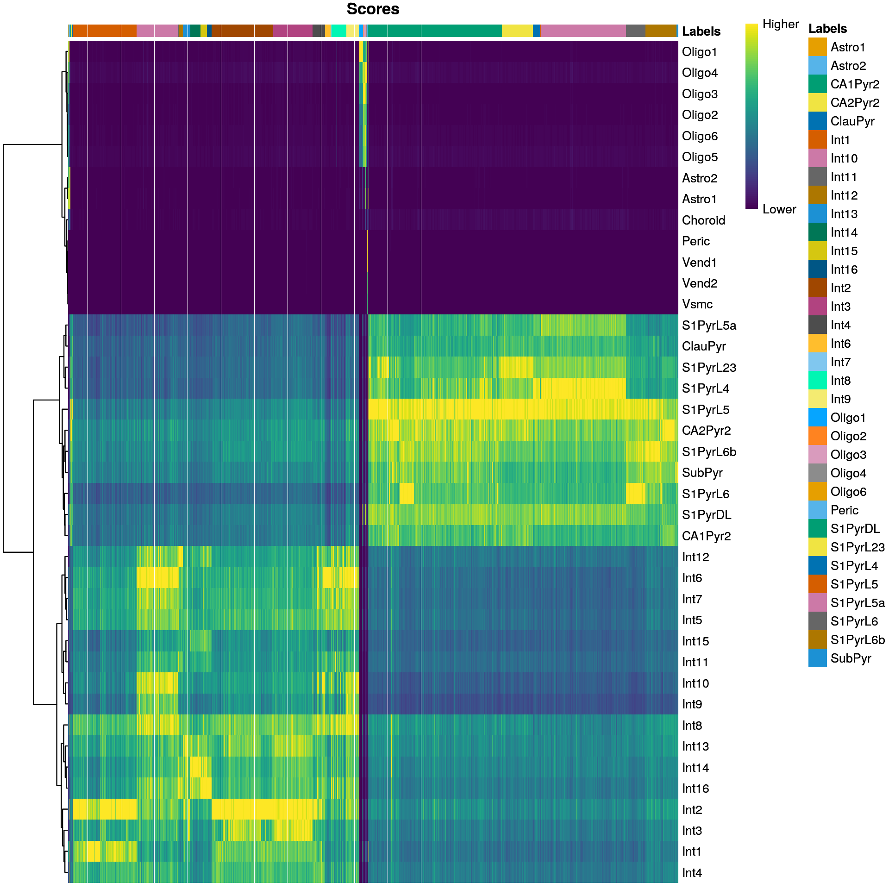
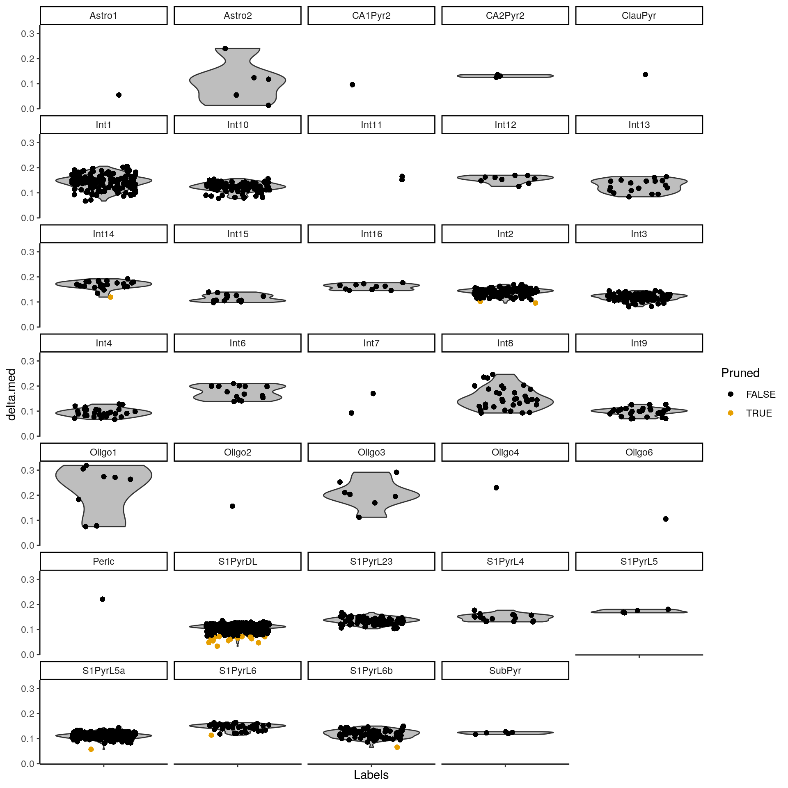
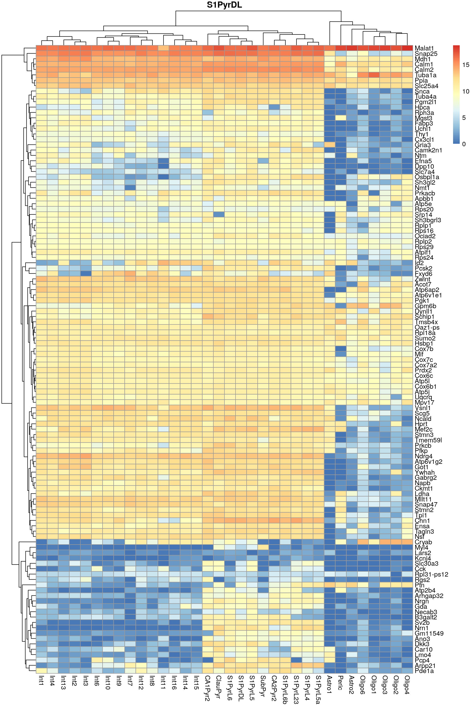
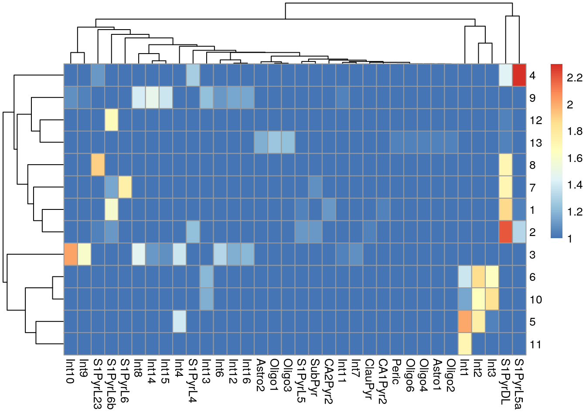

# Cross-annotating mouse brains

<script>
document.addEventListener("click", function (event) {
    if (event.target.classList.contains("aaron-collapse")) {
        event.target.classList.toggle("active");
        var content = event.target.nextElementSibling;
        if (content.style.display === "block") {
            content.style.display = "none";
        } else {
            content.style.display = "block";
        }
    }
})
</script>

<style>
.aaron-collapse {
  background-color: #eee;
  color: #444;
  cursor: pointer;
  padding: 18px;
  width: 100%;
  border: none;
  text-align: left;
  outline: none;
  font-size: 15px;
}

.aaron-content {
  padding: 0 18px;
  display: none;
  overflow: hidden;
  background-color: #f1f1f1;
}
</style>

## Loading the data

We load the classic @zeisel2015brain dataset as our reference.
Here, we'll rely on the fact that the authors have already performed quality control.


```r
library(scRNAseq)
sceZ <- ZeiselBrainData()
```

We compute log-expression values for use in marker detection inside `SingleR()`.


```r
library(scater)
sceZ <- logNormCounts(sceZ)
```

We examine the distribution of labels in this reference.


```r
table(sceZ$level2class)
```

```
## 
##    (none)    Astro1    Astro2   CA1Pyr1   CA1Pyr2 CA1PyrInt   CA2Pyr2   Choroid 
##       189        68        61       380       447        49        41        10 
##   ClauPyr     Epend      Int1     Int10     Int11     Int12     Int13     Int14 
##         5        20        12        21        10        21        15        22 
##     Int15     Int16      Int2      Int3      Int4      Int5      Int6      Int7 
##        18        20        24        10        15        20        22        23 
##      Int8      Int9      Mgl1      Mgl2    Oligo1    Oligo2    Oligo3    Oligo4 
##        26        11        17        16        45        98        87       106 
##    Oligo5    Oligo6     Peric      Pvm1      Pvm2   S1PyrDL  S1PyrL23   S1PyrL4 
##       125       359        21        32        33        81        74        26 
##   S1PyrL5  S1PyrL5a   S1PyrL6  S1PyrL6b    SubPyr     Vend1     Vend2      Vsmc 
##        16        28        39        21        22        32       105        62
```

We load the @tasic2016adult dataset as our test.
While not strictly necessary, we remove putative low-quality cells to simplify later interpretation.


```r
sceT <- TasicBrainData()
sceT <- addPerCellQC(sceT, subsets=list(mito=grep("^mt_", rownames(sceT))))
qc <- quickPerCellQC(colData(sceT), 
    percent_subsets=c("subsets_mito_percent", "altexps_ERCC_percent"))
sceT <- sceT[,which(!qc$discard)]
```

The Tasic dataset was generated using read-based technologies so we need to adjust for the transcript length.


```r
library(AnnotationHub)
mm.db <- AnnotationHub()[["AH73905"]]
mm.exons <- exonsBy(mm.db, by="gene")
mm.exons <- reduce(mm.exons)
mm.len <- sum(width(mm.exons))
mm.symb <- mapIds(mm.db, keys=names(mm.len), keytype="GENEID", column="SYMBOL")
names(mm.len) <- mm.symb

library(scater)
keep <- intersect(names(mm.len), rownames(sceT))
sceT <- sceT[keep,]
assay(sceT, "TPM") <- calculateTPM(sceT, lengths=mm.len[keep])
```

## Applying the annotation

We apply `SingleR()` with Wilcoxon rank sum test-based marker detection to annotate the Tasic dataset with the Zeisel labels.


```r
library(SingleR)
pred.tasic <- SingleR(test=sceT, ref=sceZ, labels=sceZ$level2class, 
    assay.type.test="TPM", de.method="wilcox")
```

We examine the distribution of predicted labels:


```r
table(pred.tasic$labels)
```

```
## 
##   Astro1   Astro2  CA1Pyr2  CA2Pyr2  ClauPyr     Int1    Int10    Int11 
##        1        5        1        3        1      152       98        2 
##    Int12    Int13    Int14    Int15    Int16     Int2     Int3     Int4 
##        9       18       24       16       10      146       94       29 
##     Int6     Int7     Int8     Int9   Oligo1   Oligo2   Oligo3   Oligo4 
##       14        2       35       31        8        1        7        1 
##   Oligo6    Peric  S1PyrDL S1PyrL23  S1PyrL4  S1PyrL5 S1PyrL5a  S1PyrL6 
##        1        1      319       73       16        4      201       46 
## S1PyrL6b   SubPyr 
##       73        5
```

We can also examine the number of discarded cells for each label:


```r
table(Label=pred.tasic$labels,
    Lost=is.na(pred.tasic$pruned.labels))
```

```
##           Lost
## Label      FALSE TRUE
##   Astro1       1    0
##   Astro2       5    0
##   CA1Pyr2      1    0
##   CA2Pyr2      3    0
##   ClauPyr      1    0
##   Int1       152    0
##   Int10       98    0
##   Int11        2    0
##   Int12        9    0
##   Int13       18    0
##   Int14       23    1
##   Int15       16    0
##   Int16       10    0
##   Int2       144    2
##   Int3        94    0
##   Int4        29    0
##   Int6        14    0
##   Int7         2    0
##   Int8        35    0
##   Int9        31    0
##   Oligo1       8    0
##   Oligo2       1    0
##   Oligo3       7    0
##   Oligo4       1    0
##   Oligo6       1    0
##   Peric        1    0
##   S1PyrDL    303   16
##   S1PyrL23    73    0
##   S1PyrL4     16    0
##   S1PyrL5      4    0
##   S1PyrL5a   200    1
##   S1PyrL6     45    1
##   S1PyrL6b    72    1
##   SubPyr       5    0
```

## Diagnostics

We visualize the assignment scores for each label in Figure \@ref(fig:unref-brain-score-heatmap).


```r
plotScoreHeatmap(pred.tasic)
```

<div class="figure">

<p class="caption">(\#fig:unref-brain-score-heatmap)Heatmap of the (normalized) assignment scores for each cell (column) in the Tasic test dataset with respect to each label (row) in the Zeisel reference dataset. The final assignment for each cell is shown in the annotation bar at the top.</p>
</div>

The delta for each cell is visualized in Figure \@ref(fig:unref-brain-delta-dist).


```r
plotDeltaDistribution(pred.tasic)
```

<div class="figure">

<p class="caption">(\#fig:unref-brain-delta-dist)Distributions of the deltas for each cell in the Tasic dataset assigned to each label in the Zeisel dataset. Each cell is represented by a point; low-quality assignments that were pruned out are colored in orange.</p>
</div>

Finally, we visualize the heatmaps of the marker genes for the most frequent label in Figure \@ref(fig:unref-brain-marker-heat).
We could show these for all labels but I wouldn't want to bore you with a parade of large heatmaps. 


```r
library(scater)
collected <- list()
all.markers <- metadata(pred.tasic)$de.genes

sceT <- logNormCounts(sceT)
top.label <- names(sort(table(pred.tasic$labels), decreasing=TRUE))[1]

per.label <- sumCountsAcrossCells(logcounts(sceT), 
    ids=pred.tasic$labels, average=TRUE)
per.label <- assay(per.label)[unique(unlist(all.markers[[top.label]])),]
pheatmap::pheatmap(per.label, main=top.label)
```

<div class="figure">

<p class="caption">(\#fig:unref-brain-marker-heat)Heatmap of log-expression values in the Tasic dataset for all marker genes upregulated in the most frequent label from the Zeisel reference dataset.</p>
</div>

## Comparison to clusters

For comparison, we will perform a quick unsupervised analysis of the Grun dataset.
We model the variances using the spike-in data and we perform graph-based clustering.


```r
library(scran)
decT <- modelGeneVarWithSpikes(sceT, "ERCC")

set.seed(1000100)
sceT <- denoisePCA(sceT, decT, subset.row=getTopHVGs(decT, n=2500))
sceT$cluster <- clusterSNNGraph(sceT, use.dimred="PCA")
```

We do not observe a clean 1:1 mapping between clusters and labels in Figure \@ref(fig:unref-brain-label-clusters),
probably because many of the labels represent closely related cell types that are difficult to distinguish.


```r
tab <- table(cluster=sceT$cluster, label=pred.tasic$labels) 
pheatmap::pheatmap(log10(tab+10))
```

<div class="figure">

<p class="caption">(\#fig:unref-brain-label-clusters)Heatmap of the log-transformed number of cells in each combination of label (column) and cluster (row) in the Tasic dataset.</p>
</div>

We proceed to the most important part of the analysis.
Yes, that's right, the $t$-SNE plot (Figure \@ref(fig:unref-brain-label-tsne)).


```r
set.seed(101010100)
sceT <- runTSNE(sceT, dimred="PCA")
plotTSNE(sceT, colour_by="cluster", text_colour="red",
    text_by=I(pred.tasic$labels))
```

<div class="figure">

<p class="caption">(\#fig:unref-brain-label-tsne)$t$-SNE plot of the Tasic dataset, where each point is a cell and is colored by the assigned cluster. Reference labels from the Zeisel dataset are also placed on the median coordinate across all cells assigned with that label.</p>
</div>

## Session information {-}

<button class="aaron-collapse">View session info</button>
<div class="aaron-content">
```
R version 4.0.0 Patched (2020-05-01 r78341)
Platform: x86_64-pc-linux-gnu (64-bit)
Running under: Ubuntu 18.04.4 LTS

Matrix products: default
BLAS:   /home/luna/Software/R/R-4-0-branch-dev/lib/libRblas.so
LAPACK: /home/luna/Software/R/R-4-0-branch-dev/lib/libRlapack.so

locale:
 [1] LC_CTYPE=en_US.UTF-8       LC_NUMERIC=C              
 [3] LC_TIME=en_US.UTF-8        LC_COLLATE=en_US.UTF-8    
 [5] LC_MONETARY=en_US.UTF-8    LC_MESSAGES=en_US.UTF-8   
 [7] LC_PAPER=en_US.UTF-8       LC_NAME=C                 
 [9] LC_ADDRESS=C               LC_TELEPHONE=C            
[11] LC_MEASUREMENT=en_US.UTF-8 LC_IDENTIFICATION=C       

attached base packages:
[1] parallel  stats4    stats     graphics  grDevices utils     datasets 
[8] methods   base     

other attached packages:
 [1] scran_1.17.4                SingleR_1.3.6              
 [3] ensembldb_2.13.1            AnnotationFilter_1.13.0    
 [5] GenomicFeatures_1.41.0      AnnotationDbi_1.51.1       
 [7] AnnotationHub_2.21.1        BiocFileCache_1.13.0       
 [9] dbplyr_1.4.4                scater_1.17.3              
[11] ggplot2_3.3.2               scRNAseq_2.3.6             
[13] SingleCellExperiment_1.11.6 SummarizedExperiment_1.19.5
[15] DelayedArray_0.15.6         matrixStats_0.56.0         
[17] Matrix_1.2-18               Biobase_2.49.0             
[19] GenomicRanges_1.41.5        GenomeInfoDb_1.25.5        
[21] IRanges_2.23.10             S4Vectors_0.27.12          
[23] BiocGenerics_0.35.4         BiocStyle_2.17.0           
[25] rebook_0.99.0              

loaded via a namespace (and not attached):
  [1] Rtsne_0.15                    ggbeeswarm_0.6.0             
  [3] colorspace_1.4-1              ellipsis_0.3.1               
  [5] scuttle_0.99.10               XVector_0.29.3               
  [7] BiocNeighbors_1.7.0           farver_2.0.3                 
  [9] bit64_0.9-7                   interactiveDisplayBase_1.27.5
 [11] codetools_0.2-16              knitr_1.29                   
 [13] Rsamtools_2.5.3               pheatmap_1.0.12              
 [15] graph_1.67.1                  shiny_1.5.0                  
 [17] BiocManager_1.30.10           compiler_4.0.0               
 [19] httr_1.4.1                    dqrng_0.2.1                  
 [21] assertthat_0.2.1              fastmap_1.0.1                
 [23] lazyeval_0.2.2                limma_3.45.7                 
 [25] later_1.1.0.1                 BiocSingular_1.5.0           
 [27] htmltools_0.5.0               prettyunits_1.1.1            
 [29] tools_4.0.0                   igraph_1.2.5                 
 [31] rsvd_1.0.3                    gtable_0.3.0                 
 [33] glue_1.4.1                    GenomeInfoDbData_1.2.3       
 [35] dplyr_1.0.0                   rappdirs_0.3.1               
 [37] Rcpp_1.0.4.6                  vctrs_0.3.1                  
 [39] Biostrings_2.57.2             ExperimentHub_1.15.0         
 [41] rtracklayer_1.49.3            DelayedMatrixStats_1.11.1    
 [43] xfun_0.15                     stringr_1.4.0                
 [45] ps_1.3.3                      mime_0.9                     
 [47] lifecycle_0.2.0               irlba_2.3.3                  
 [49] statmod_1.4.34                XML_3.99-0.3                 
 [51] edgeR_3.31.4                  zlibbioc_1.35.0              
 [53] scales_1.1.1                  hms_0.5.3                    
 [55] promises_1.1.1                ProtGenerics_1.21.0          
 [57] RColorBrewer_1.1-2            yaml_2.2.1                   
 [59] curl_4.3                      memoise_1.1.0                
 [61] gridExtra_2.3                 biomaRt_2.45.1               
 [63] stringi_1.4.6                 RSQLite_2.2.0                
 [65] highr_0.8                     BiocVersion_3.12.0           
 [67] BiocParallel_1.23.0           rlang_0.4.6                  
 [69] pkgconfig_2.0.3               bitops_1.0-6                 
 [71] evaluate_0.14                 lattice_0.20-41              
 [73] purrr_0.3.4                   labeling_0.3                 
 [75] GenomicAlignments_1.25.3      CodeDepends_0.6.5            
 [77] cowplot_1.0.0                 bit_1.1-15.2                 
 [79] processx_3.4.2                tidyselect_1.1.0             
 [81] magrittr_1.5                  bookdown_0.20                
 [83] R6_2.4.1                      generics_0.0.2               
 [85] DBI_1.1.0                     pillar_1.4.4                 
 [87] withr_2.2.0                   RCurl_1.98-1.2               
 [89] tibble_3.0.1                  crayon_1.3.4                 
 [91] rmarkdown_2.3                 viridis_0.5.1                
 [93] progress_1.2.2                locfit_1.5-9.4               
 [95] grid_4.0.0                    blob_1.2.1                   
 [97] callr_3.4.3                   digest_0.6.25                
 [99] xtable_1.8-4                  httpuv_1.5.4                 
[101] openssl_1.4.2                 munsell_0.5.0                
[103] beeswarm_0.2.3                viridisLite_0.3.0            
[105] vipor_0.4.5                   askpass_1.1                  
```
</div>
