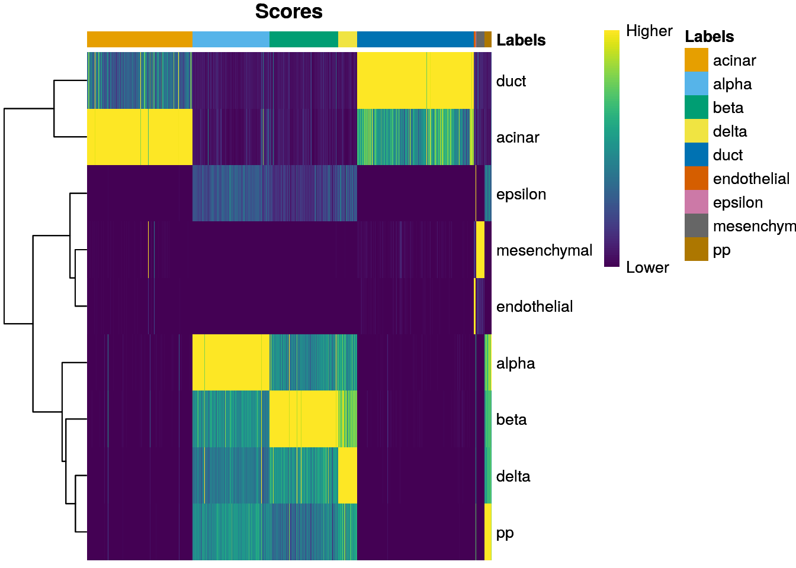
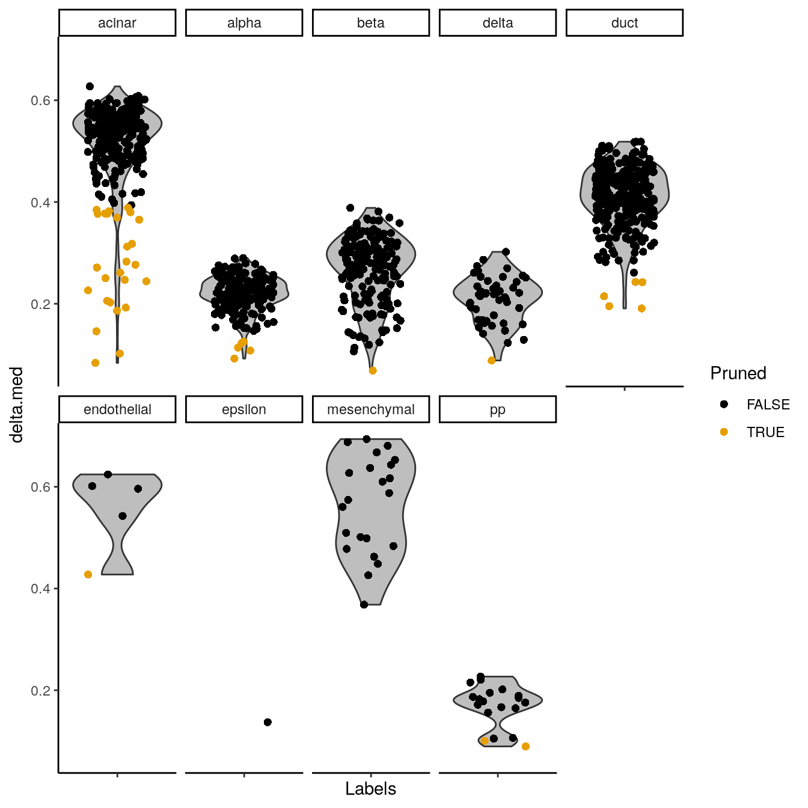

# Annotation diagnostics

<script>
document.addEventListener("click", function (event) {
    if (event.target.classList.contains("aaron-collapse")) {
        event.target.classList.toggle("active");
        var content = event.target.nextElementSibling;
        if (content.style.display === "block") {
            content.style.display = "none";
        } else {
            content.style.display = "block";
        }
    }
})
</script>

<style>
.aaron-collapse {
  background-color: #eee;
  color: #444;
  cursor: pointer;
  padding: 18px;
  width: 100%;
  border: none;
  text-align: left;
  outline: none;
  font-size: 15px;
}

.aaron-content {
  padding: 0 18px;
  display: none;
  overflow: hidden;
  background-color: #f1f1f1;
}
</style>

## Overview

In addition to the labels, `SingleR()` returns a number of helpful diagnostics about the annotation process
that can be used to determine whether the assignments are appropriate.
Unambiguous assignments corroborated by expression of canonical markers add confidence to the results;
conversely, low-confidence assignments can be pruned out to avoid adding noise to downstream analyses.
This chapter will demonstrate some of these common sanity checks on the pancreas datasets
from Chapter \@ref(using-single-cell-references) [@muraro2016singlecell;@grun2016denovo].

<button class="aaron-collapse">View history</button>
<div class="aaron-content">
   
```r
#--- loading-muraro ---#
library(scRNAseq)
sceM <- MuraroPancreasData()

sceM <- sceM[,!is.na(sceM$label) & sceM$label!="unclear"] 

library(scater)
sceM <- logNormCounts(sceM)

#--- loading-grun ---#
sceG <- GrunPancreasData()

sceG <- addPerCellQC(sceG)
qc <- quickPerCellQC(colData(sceG), 
    percent_subsets="altexps_ERCC_percent",
    batch=sceG$donor,
    subset=sceG$donor %in% c("D17", "D7", "D2"))
sceG <- sceG[,!qc$discard]

sceG <- logNormCounts(sceG)

#--- annotation ---#
library(SingleR)
pred.grun <- SingleR(test=sceG, ref=sceM, labels=sceM$label, de.method="wilcox")
```

</div>

## Based on the scores within cells

The most obvious diagnostic reported by `SingleR()` is the nested matrix of per-cell scores in the `scores` field. 
This contains the correlation-based scores prior to any fine-tuning for each cell (row) and reference label (column).
Ideally, we would see unambiguous assignments where, for any given cell, one label's score is clearly larger than the others.


```r
pred.grun$scores[1:10,]
```

```
##       acinar  alpha   beta  delta   duct endothelial epsilon mesenchymal
##  [1,] 0.6797 0.1463 0.1554 0.1029 0.4971      0.2030 0.04434      0.1848
##  [2,] 0.6832 0.1849 0.1611 0.1250 0.5133      0.2231 0.08909      0.2140
##  [3,] 0.6845 0.2032 0.2141 0.1875 0.5060      0.2286 0.08960      0.1961
##  [4,] 0.6472 0.2050 0.2115 0.1879 0.7300      0.2285 0.12107      0.2708
##  [5,] 0.6079 0.2285 0.2419 0.1938 0.6616      0.2659 0.16007      0.3228
##  [6,] 0.5816 0.2789 0.2611 0.2661 0.6827      0.2857 0.21781      0.3151
##  [7,] 0.5704 0.3268 0.2990 0.2618 0.6293      0.2947 0.20834      0.3263
##  [8,] 0.5692 0.2455 0.2152 0.2033 0.6495      0.2652 0.18469      0.2943
##  [9,] 0.6421 0.2101 0.1929 0.1894 0.7201      0.2795 0.14615      0.3142
## [10,] 0.7153 0.2109 0.1747 0.1606 0.5896      0.1687 0.15639      0.1778
##            pp
##  [1,] 0.08954
##  [2,] 0.11207
##  [3,] 0.15207
##  [4,] 0.14351
##  [5,] 0.18475
##  [6,] 0.21898
##  [7,] 0.25871
##  [8,] 0.19160
##  [9,] 0.17281
## [10,] 0.16314
```

To check whether this is indeed the case, 
we use the `plotScoreHeatmap()` function to visualize the score matrix (Figure \@ref(fig:score-heatmap-grun)).
Here, the key is to examine the spread of scores within each cell, i.e., down the columns of the heatmap.
Similar scores for a group of labels indicates that the assignment is uncertain for those columns,
though this may be acceptable if the uncertainty is distributed across closely related cell types.


```r
library(SingleR)
plotScoreHeatmap(pred.grun)
```

<div class="figure">

<p class="caption">(\#fig:score-heatmap-grun)Heatmap of normalized scores for the Grun dataset. Each cell is a column while each row is a label in the reference Muraro dataset. The final label (after fine-tuning) for each cell is shown in the top color bar.</p>
</div>

We can also display other metadata information for each cell by setting `clusters=` or `annotation_col=`.
This is occasionally useful for examining potential batch effects, 
differences in cell type composition between conditions, 
relationship to clusters from an unsupervised analysis and so on,.
For example, Figure \@ref(fig:score-heatmap-grun-donor) displays the donor of origin for each cell;
we can see that each cell type has contributions from multiple donors, 
which is reassuring as it indicates that our assignments are not (purely) driven by donor effects.


```r
plotScoreHeatmap(pred.grun, 
    annotation_col=as.data.frame(colData(sceG)[,"donor",drop=FALSE]))
```

<div class="figure">

<p class="caption">(\#fig:score-heatmap-grun-donor)Heatmap of normalized scores for the Grun dataset, including the donor of origin for each cell.</p>
</div>


The `scores` matrix has several caveats associated with its interpretation.
Only the pre-tuned scores are stored in this matrix, as scores after fine-tuning are not comparable across all labels.
This means that the label with the highest score for a cell may not be the cell's final label if fine-tuning is applied.
Moreover, the magnitude of differences in the scores has no clear interpretation;
indeed, `plotScoreHeatmap()` dispenses with any faithful representation of the scores 
and instead adjusts the values to highlight any differences between labels within each cell.

## Based on the deltas across cells

We identify poor-quality or ambiguous assignments based on the per-cell "delta", 
i.e., the difference between the score for the assigned label and the median across all labels for each cell.
Our assumption is that most of the labels in the reference are not relevant to any given cell. 
Thus, the median across all labels can be used as a measure of the baseline correlation,
while the gap from the assigned label to this baseline can be used as a measure of the assignment confidence.

Low deltas indicate that the assignment is uncertain, possibly because the cell's true label does not exist in the reference.
An obvious next step is to apply a threshold on the delta to filter out these low-confidence assignments.
We use the delta rather than the assignment score as the latter is more sensitive to technical effects.
For example, changes in library size affect the technical noise and can increase/decrease all scores for a given cell,
while the delta is somewhat more robust as it focuses on the differences between scores within each cell.

`SingleR()` will set a threshold on the delta for each label using an outlier-based strategy.
Specifically, we identify cells with deltas that are small outliers relative to the deltas of other cells with the same label.
This assumes that, for any given label, most cells assigned to that label are correct.
We focus on outliers to avoid difficulties with setting a fixed threshold,
especially given that the magnitudes of the deltas are about as uninterpretable as the scores themselves.
Pruned labels are reported in the `pruned.labels` field where low-quality assignments are replaced with `NA`.


```r
to.remove <- is.na(pred.grun$pruned.labels)
table(Label=pred.grun$labels, Removed=to.remove)
```

```
##              Removed
## Label         FALSE TRUE
##   acinar        251   26
##   alpha         198    5
##   beta          180    1
##   delta          49    1
##   duct          301    5
##   endothelial     4    1
##   epsilon         1    0
##   mesenchymal    22    0
##   pp             17    2
```

However, the default pruning parameters may not be appropriate for every dataset.
For example, if one label is consistently misassigned, the assumption that most cells are correctly assigned will not be appropriate.
In such cases, we can revert to a fixed threshold by manually calling the underlying `pruneScores()` function with `min.diff.med=`.
The example below discards cells with deltas below an arbitrary threshold of 0.2,
where higher thresholds correspond to greater assignment certainty.


```r
to.remove <- pruneScores(pred.grun, min.diff.med=0.2)
table(Label=pred.grun$labels, Removed=to.remove)
```

```
##              Removed
## Label         FALSE TRUE
##   acinar        250   27
##   alpha         155   48
##   beta          148   33
##   delta          33   17
##   duct          301    5
##   endothelial     4    1
##   epsilon         0    1
##   mesenchymal    22    0
##   pp              4   15
```

This entire process can be visualized using the `plotScoreDistribution()` function,
which displays the per-label distribution of the deltas across cells (Figure \@ref(fig:score-dist-grun)).
We can use this plot to check that outlier detection in `pruneScores()` behaved sensibly.
Labels with especially low deltas may warrant some additional caution in their interpretation.


```r
plotDeltaDistribution(pred.grun)
```

<div class="figure">

<p class="caption">(\#fig:score-dist-grun)Distribution of deltas for the Grun dataset. Each facet represents a label in the Muraro dataset, and each point represents a cell assigned to that label (colored by whether it was pruned).</p>
</div>

If fine-tuning was performed, we can apply an even more stringent filter 
based on the difference between the highest and second-highest scores after fine-tuning.
Cells will only pass the filter if they are assigned to a label that is clearly distinguishable from any other label.
In practice, this approach tends to be too conservative as assignments involving closely related labels are heavily penalized.


```r
to.remove2 <- pruneScores(pred.grun, min.diff.next=0.1)
table(Label=pred.grun$labels, Removed=to.remove2)
```

```
##              Removed
## Label         FALSE TRUE
##   acinar        235   42
##   alpha         166   37
##   beta          117   64
##   delta          25   25
##   duct          157  149
##   endothelial     4    1
##   epsilon         0    1
##   mesenchymal    22    0
##   pp              9   10
```

## Based on marker gene expression

Another simple yet effective diagnostic is to examine the expression of the marker genes for each label in the test dataset.
The marker genes used for each label are reported in the `metadata()` of the `SingleR()` output,
so we can simply retrieve them to visualize their (usually log-transformed) expression values across the test dataset.
Here, we use the  `plotHeatmap()` function from *[scater](https://bioconductor.org/packages/3.12/scater)* 
to examine the expression of markers used to identify beta cells (Figure \@ref(fig:grun-beta-heat)).


```r
all.markers <- metadata(pred.grun)$de.genes
sceG$labels <- pred.grun$labels

library(scater)
plotHeatmap(sceG, order_columns_by="labels",
    features=unique(unlist(all.markers$beta))) 
```

<div class="figure">

<p class="caption">(\#fig:grun-beta-heat)Heatmap of log-expression values in the Grun dataset for all marker genes upregulated in beta cells in the Muraro reference dataset. Assigned labels for each cell are shown at the top of the plot.</p>
</div>

If a cell in the test dataset is confidently assigned to a particular label, 
we would expect it to have strong expression of that label's markers.
We would also hope that those label's markers are biologically meaningful;
in this case, we do observe strong upregulation of insulin (_INS_) in the beta cells, 
which is reassuring and gives greater confidence to the correctness of the assignment.
If the identified markers are not meaningful or not consistently upregulated, 
some skepticism towards the quality of the assignments is warranted.

It is straightforward to repeat this process for all labels by wrapping this code in a loop, 
as shown below in Figure \@ref(fig:grun-beta-heat-all).
Note that `plotHeatmap()` is not the only function that can be used for this visualization;
we could also use `plotDots()` to create a *[Seurat](https://CRAN.R-project.org/package=Seurat)*-style dot plot,
or we could use other heatmap plotting functions such as `dittoHeatmap()` from *[dittoSeq](https://bioconductor.org/packages/3.12/dittoSeq)*.


```r
collected <- list()
for (lab in unique(pred.grun$labels)) {
    collected[[lab]] <- plotHeatmap(sceG, silent=TRUE, 
        order_columns_by="labels", main=lab,
        features=unique(unlist(all.markers[[lab]])))[[4]] 
}
do.call(gridExtra::grid.arrange, collected)
```

<div class="figure">

<p class="caption">(\#fig:grun-beta-heat-all)Heatmaps of log-expression values in the Grun dataset for all marker genes upregulated in each label in the Muraro reference dataset. Assigned labels for each cell are shown at the top of each plot.</p>
</div>

In general, the heatmap provides a more interpretable diagnostic visualization than the plots of scores and deltas.
However, it does require more effort to inspect and may not be feasible for large numbers of labels.
It is also difficult to use a heatmap to determine the correctness of assignment for closely related labels.

## Session information {-}

<button class="aaron-collapse">View session info</button>
<div class="aaron-content">
```
R version 4.0.0 Patched (2020-05-01 r78341)
Platform: x86_64-pc-linux-gnu (64-bit)
Running under: Ubuntu 18.04.4 LTS

Matrix products: default
BLAS:   /home/luna/Software/R/R-4-0-branch-dev/lib/libRblas.so
LAPACK: /home/luna/Software/R/R-4-0-branch-dev/lib/libRlapack.so

locale:
 [1] LC_CTYPE=en_US.UTF-8       LC_NUMERIC=C              
 [3] LC_TIME=en_US.UTF-8        LC_COLLATE=en_US.UTF-8    
 [5] LC_MONETARY=en_US.UTF-8    LC_MESSAGES=en_US.UTF-8   
 [7] LC_PAPER=en_US.UTF-8       LC_NAME=C                 
 [9] LC_ADDRESS=C               LC_TELEPHONE=C            
[11] LC_MEASUREMENT=en_US.UTF-8 LC_IDENTIFICATION=C       

attached base packages:
[1] parallel  stats4    stats     graphics  grDevices utils     datasets 
[8] methods   base     

other attached packages:
 [1] scater_1.17.3               ggplot2_3.3.1              
 [3] SingleCellExperiment_1.11.4 SingleR_1.3.5              
 [5] SummarizedExperiment_1.19.5 DelayedArray_0.15.1        
 [7] matrixStats_0.56.0          Biobase_2.49.0             
 [9] GenomicRanges_1.41.5        GenomeInfoDb_1.25.1        
[11] IRanges_2.23.9              S4Vectors_0.27.12          
[13] BiocGenerics_0.35.4         BiocStyle_2.17.0           
[15] rebook_0.99.0              

loaded via a namespace (and not attached):
 [1] bitops_1.0-6                  bit64_0.9-7                  
 [3] RColorBrewer_1.1-2            httr_1.4.1                   
 [5] tools_4.0.0                   R6_2.4.1                     
 [7] irlba_2.3.3                   vipor_0.4.5                  
 [9] colorspace_1.4-1              DBI_1.1.0                    
[11] withr_2.2.0                   gridExtra_2.3                
[13] tidyselect_1.1.0              processx_3.4.2               
[15] bit_1.1-15.2                  curl_4.3                     
[17] compiler_4.0.0                graph_1.67.1                 
[19] BiocNeighbors_1.7.0           labeling_0.3                 
[21] bookdown_0.19                 scales_1.1.1                 
[23] callr_3.4.3                   rappdirs_0.3.1               
[25] stringr_1.4.0                 digest_0.6.25                
[27] rmarkdown_2.2                 XVector_0.29.2               
[29] pkgconfig_2.0.3               htmltools_0.4.0              
[31] highr_0.8                     dbplyr_1.4.4                 
[33] fastmap_1.0.1                 rlang_0.4.6                  
[35] RSQLite_2.2.0                 shiny_1.4.0.2                
[37] DelayedMatrixStats_1.11.0     farver_2.0.3                 
[39] generics_0.0.2                BiocParallel_1.23.0          
[41] dplyr_1.0.0                   RCurl_1.98-1.2               
[43] magrittr_1.5                  BiocSingular_1.5.0           
[45] scuttle_0.99.9                GenomeInfoDbData_1.2.3       
[47] Matrix_1.2-18                 ggbeeswarm_0.6.0             
[49] munsell_0.5.0                 Rcpp_1.0.4.6                 
[51] viridis_0.5.1                 lifecycle_0.2.0              
[53] stringi_1.4.6                 yaml_2.2.1                   
[55] zlibbioc_1.35.0               BiocFileCache_1.13.0         
[57] AnnotationHub_2.21.0          grid_4.0.0                   
[59] blob_1.2.1                    promises_1.1.1               
[61] ExperimentHub_1.15.0          crayon_1.3.4                 
[63] lattice_0.20-41               CodeDepends_0.6.5            
[65] knitr_1.28                    ps_1.3.3                     
[67] pillar_1.4.4                  codetools_0.2-16             
[69] XML_3.99-0.3                  glue_1.4.1                   
[71] BiocVersion_3.12.0            evaluate_0.14                
[73] BiocManager_1.30.10           vctrs_0.3.1                  
[75] httpuv_1.5.4                  gtable_0.3.0                 
[77] purrr_0.3.4                   assertthat_0.2.1             
[79] xfun_0.14                     rsvd_1.0.3                   
[81] mime_0.9                      xtable_1.8-4                 
[83] later_1.1.0.1                 viridisLite_0.3.0            
[85] pheatmap_1.0.12               tibble_3.0.1                 
[87] beeswarm_0.2.3                AnnotationDbi_1.51.0         
[89] memoise_1.1.0                 ellipsis_0.3.1               
[91] interactiveDisplayBase_1.27.5
```
</div>
