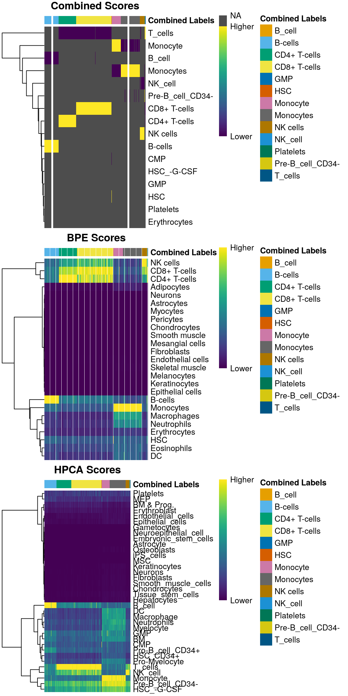
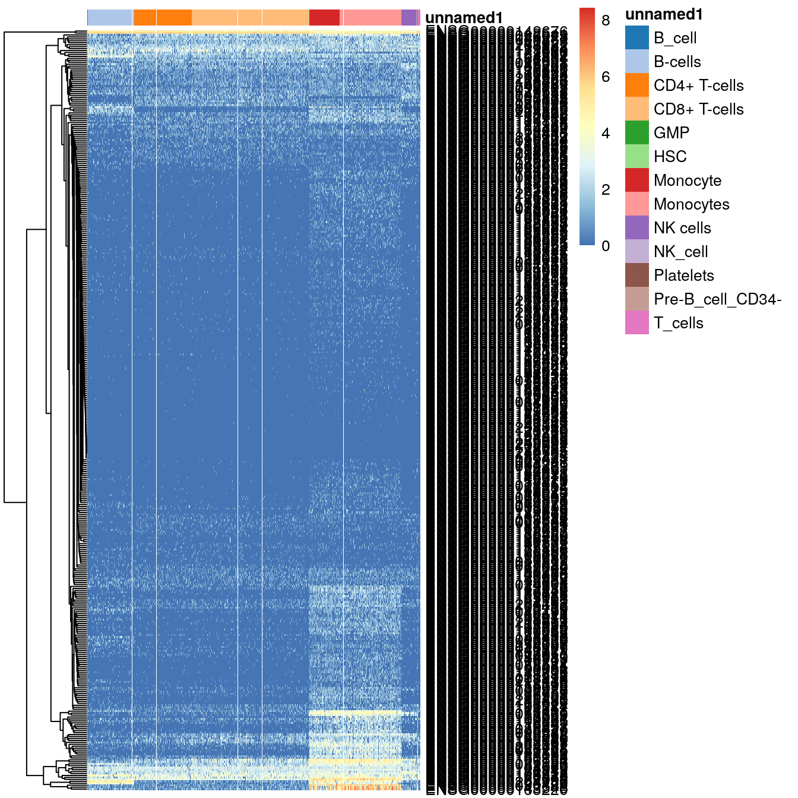

# (PART) Advanced usage {-}

# Using multiple references

<script>
document.addEventListener("click", function (event) {
    if (event.target.classList.contains("aaron-collapse")) {
        event.target.classList.toggle("active");
        var content = event.target.nextElementSibling;
        if (content.style.display === "block") {
            content.style.display = "none";
        } else {
            content.style.display = "block";
        }
    }
})
</script>

<style>
.aaron-collapse {
  background-color: #eee;
  color: #444;
  cursor: pointer;
  padding: 18px;
  width: 100%;
  border: none;
  text-align: left;
  outline: none;
  font-size: 15px;
}

.aaron-content {
  padding: 0 18px;
  display: none;
  overflow: hidden;
  background-color: #f1f1f1;
}
</style>

## Overview

In some cases, we may wish to use multiple references for annotation of a test dataset.
This yields a more comprehensive set of cell types that are not covered by any individual reference, 
especially when differences in the resolution are considered.
However, it is not trivial due to the presence of batch effects across references
(from differences in technology, experimental protocol or the biological system)
as well as differences in the annotation vocabulary between investigators.

Several strategies are available to combine inferences from multiple references:

- using reference-specific labels in a combined reference
- using harmonized labels in a combined reference
- combining scores across multiple references

This chapter discusses the various strengths and weaknesses of each strategy
and provides some practical demonstrations of each.
Here, we will use the HPCA and BlueprintEncode datasets as our references
and (yet another) PBMC dataset as the test.


```r
library(TENxPBMCData)
pbmc <- TENxPBMCData("pbmc8k")

library(SingleR)
hpca <- HumanPrimaryCellAtlasData(ensembl=TRUE)
bpe <- BlueprintEncodeData(ensembl=TRUE)
```

## Using reference-specific labels

In this strategy, each label is defined in the context of its reference dataset.
This means that a label - say, "B cell" - in reference dataset X is 
considered to be different from a "B cell" label in reference dataset Y.
Use of reference-specific labels is most appropriate if there are relevant biological differences between the references;
for example, if one reference is concerned with healthy tissue while the other reference considers diseased tissue,
it can be helpful to distinguish between the same cell type in different biological contexts.

We can easily implement this approach by combining the expression matrices together 
and pasting the reference name onto the corresponding character vector of labels. 
This modification ensures that the downstream `SingleR()` call
will treat each label-reference combination as a distinct entity.


```r
hpca2 <- hpca
hpca2$label.main <- paste0("HPCA.", hpca2$label.main)

bpe2 <- bpe
bpe2$label.main <- paste0("BPE.", bpe2$label.main)

shared <- intersect(rownames(hpca2), rownames(bpe2))
combined <- cbind(hpca2[shared,], bpe2[shared,])
```

It is then straightforward to perform annotation with the usual methods.


```r
com.res1 <- SingleR(pbmc, ref=combined, labels=combined$label.main, assay.type.test=1)
table(com.res1$labels)
```

```
## 
##      BPE.B-cells BPE.CD4+ T-cells BPE.CD8+ T-cells          BPE.HSC 
##             1179             1708             2656               20 
##    BPE.Monocytes     BPE.NK cells  HPCA.HSC_-G-CSF   HPCA.Platelets 
##             2348              460                1                7 
##     HPCA.T_cells 
##                2
```

However, this strategy identifies markers by directly comparing expression values across references,
meaning that the marker set is likely to contain genes responsible for uninteresting batch effects. 
This will increase noise during the calculation of the score in each reference, 
possibly leading to a loss of precision and a greater risk of technical variation dominating the classification results.
The use of reference-specific labels also complicates interpretation of the results
as the cell type is always qualified by its reference of origin.

## Comparing scores across references

### Combining inferences from individual references

Another strategy - and the default approach implemented in `SingleR()` -
involves performing classification separately within each reference, 
and then collating the results to choose the label with the highest score across references. 
This is a relatively expedient approach that avoids the need for explicit harmonization 
while also reducing exposure to reference-specific batch effects.

To use this method, we simply pass multiple objects to the `ref=` and `label=` argument in `SingleR()`.
The combining strategy is as follows:

1. The function first annotates the test dataset with each reference individually
in the same manner as described in Section \@ref(method-description).
This step is almost equivalent to simply looping over all individual references and running `SingleR()` on each.
2. For each cell, the function collects its predicted labels across all references.
In doing so, it also identifies the union of markers that are upregulated in the predicted label in each reference.
3. The function identifies the overall best-scoring label as the final prediction for that cell.
This step involves a recomputation of the scores across the identified marker subset 
to ensure that these scores are derived from the same set of genes (and are thus comparable across references).

The function will then return a `DataFrame` of combined results for each cell in the test dataset,
including the overall label and the reference from which it was assigned.


```r
com.res2 <- SingleR(test = pbmc, assay.type.test=1,
    ref = list(BPE=bpe, HPCA=hpca), 
    labels = list(bpe$label.main, hpca$label.main))

# Check the final label from the combined assignment.
table(com.res2$labels) 
```

```
## 
##           B_cell          B-cells     CD4+ T-cells     CD8+ T-cells 
##               14             1170             1450             2936 
##              GMP              HSC         Monocyte        Monocytes 
##                1               22              753             1560 
##         NK cells          NK_cell        Platelets Pre-B_cell_CD34- 
##              372               10                9               16 
##          T_cells 
##               68
```

```r
# Check the 'winning' reference for each cell.
table(com.res2$reference) 
```

```
## 
##    1    2 
## 7510  871
```

The main appeal of this approach lies in the fact that it is based on the results of annotation with individual references.
This avoids batch effects from comparing expression values across references;
it reduces the need for any coordination in the label scheme between references;
and simultaneously provides the per-reference annotations in the results.
The last feature is particularly useful as it allows for more detailed diagnostics, troubleshooting and further analysis.


```r
head(com.res2$orig.results$BPE$labels)
```

```
## [1] "B-cells"      "Monocytes"    "CD8+ T-cells" "CD8+ T-cells" "Monocytes"   
## [6] "Monocytes"
```

```r
head(com.res2$orig.results$HPCA$labels)
```

```
## [1] "B_cell"   "Monocyte" "T_cells"  "T_cells"  "Monocyte" "Monocyte"
```

The main downside is that it is somewhat suboptimal if there are many labels that are unique to one reference,
as markers are not identified with the aim of distinguishing a label in one reference from another label in another reference.
The continued lack of consistency in the labels across references also complicates interpretation of the results,
though we can overcome this by using harmonized labels as described below.

### Combined diagnostics

All of the diagnostic plots in *[SingleR](https://bioconductor.org/packages/3.12/SingleR)* will naturally operate on these combined results.
For example, we can create a heatmap of the scores in all of the individual references
as well as for the recomputed scores in the combined results (Figure \@ref(fig:heat-combined)).
Note that scores are only recomputed for the labels predicted in the individual references,
so all labels outside of those are simply set to `NA` - hence the swathes of grey.


```r
plotScoreHeatmap(com.res2)
```

<div class="figure">

<p class="caption">(\#fig:heat-combined)Heatmaps of assignment scores for each cell in the PBMC test dataset after being assigned to the Blueprint/ENCODE and Human Primary Cell Atlas reference datasets. One heatmap is shown for the recomputed scores and the scores from each individual reference. The annotation at the top of each heatmap represents the final combined prediction for each cell.</p>
</div>

The deltas for each individual reference can also be plotted with `plotDeltaDistribution()` (Figure \@ref(fig:delta-combined)).
No deltas are shown for the recomputed scores as the assumption described in Section \@ref(based-on-the-deltas-across-cells)
may not be applicable across the predicted labels from the individual references.
For example, if all individual references suggest the same cell type with similar recomputed scores, 
any delta would be low even though the assignment is highly confident.


```r
plotDeltaDistribution(com.res2)
```

<div class="figure">

<p class="caption">(\#fig:delta-combined)Distribution of the deltas across cells in the PBMC test dataset for each label in the Blueprint/ENCODE and Human Primary Cell Atlas reference datasets. Each point represents a cell that was assigned to that label in the combined results, colored by whether it was pruned or not in the corresponding individual reference.</p>
</div>

We can similarly extract marker genes to use in heatmaps as described in Section \@ref(based-on-marker-gene-expression).
As annotation was performed to each individual reference,
we can simply extract the marker genes from the nested `DataFrame`s as shown in Figure \@ref(fig:pbmc-mono-heat).


```r
hpca.markers <- metadata(com.res2$orig.results$HPCA)$de.genes
bpe.markers <- metadata(com.res2$orig.results$BPE)$de.genes
mono.markers <- unique(unlist(hpca.markers$Monocyte, bpe.markers$Monocytes))

library(scater)
plotHeatmap(logNormCounts(pbmc), 
    order_columns_by=list(I(com.res2$labels)),
    features=mono.markers)
```

<div class="figure">

<p class="caption">(\#fig:pbmc-mono-heat)Heatmap of log-expression values in the PBMC dataset for all marker genes upregulated in monocytes in the Blueprint/ENCODE and Human Primary Cell Atlas reference datasets. Combined labels for each cell are shown at the top.</p>
</div>

## Using harmonized labels

### Sharing information during marker detection

One of the major problems with using multiple references is the presence of study-specific nomenclature.
For example, the concept of a B cell may be annotated as `B cells` in one reference, 
`B_cells` in another reference, and then `B` and `B-cell` and so on in other references.
We can overcome this by using harmonized labels where the same cell type is assigned as the same label across references,
simplifying interpretation and ensuring that irrelevant discrepancies in labelling do not intefere with downstream analysis.

Many of the *[SingleR](https://bioconductor.org/packages/3.12/SingleR)* reference datasets already have their labels 
mapped to the [Cell Ontology](https://www.ebi.ac.uk/ols/ontologies/cl),
which provides a standard vocabulary to refer to the same cell type across diverse datasets.
We will describe the utility of Cell Ontology terms in more detail in Chapter \@ref(exploiting-the-cell-ontology);
at this point, the key idea is that the same term is used for the same conceptual cell type in each reference.
To simplify interpretation, we set `cell.ont="nonna"` to remove all samples that could not be mapped to the ontology.


```r
hpca.ont <- HumanPrimaryCellAtlasData(ensembl=TRUE, cell.ont="nonna")
bpe.ont <- BlueprintEncodeData(ensembl=TRUE, cell.ont="nonna")

# Using the same sets of genes:
shared <- intersect(rownames(hpca.ont), rownames(bpe.ont))
hpca.ont <- hpca.ont[shared,]
bpe.ont <- bpe.ont[shared,]

# Showing the top 10 most frequent terms:
head(sort(table(hpca.ont$label.ont)), 10)
```

```
## 
## CL:0002259 CL:0000017 CL:0000049 CL:0000050 CL:0000084 CL:0000127 CL:0000557 
##          1          2          2          2          2          2          2 
## CL:0000798 CL:0000816 CL:0000836 
##          2          2          2
```

```r
head(sort(table(bpe.ont$label.ont)), 10)
```

```
## 
## CL:0000451 CL:0000771 CL:0000787 CL:0000815 CL:0000904 CL:0000905 CL:0000907 
##          1          1          1          1          1          1          1 
## CL:0000913 CL:0000972 CL:0000127 
##          1          1          2
```

The simplest way to take advantage of the standardization in terminology
is to use `label.ont` in place of `label.main` in the previous section's `SingleR()` call.
This yields annotations that have follow the same vocabulary regardless of the reference used for assignment.


```r
com.res3a <- SingleR(test = pbmc, assay.type.test=1,
    ref = list(BPE=bpe.ont, HPCA=hpca.ont), 
    labels = list(bpe.ont$label.ont, hpca.ont$label.ont))

table(Label=com.res3a$labels, Reference=com.res3a$reference)
```

```
##             Reference
## Label           1    2
##   CL:0000037    2    0
##   CL:0000050    6    0
##   CL:0000051    6    0
##   CL:0000233    0    3
##   CL:0000236    0   70
##   CL:0000556    7    0
##   CL:0000557    4    1
##   CL:0000576 1520  548
##   CL:0000623  304   10
##   CL:0000624  734   34
##   CL:0000625  591   89
##   CL:0000786    2    0
##   CL:0000787  270    3
##   CL:0000788  728   12
##   CL:0000798    0    2
##   CL:0000815   78    0
##   CL:0000816    0   21
##   CL:0000837    5    0
##   CL:0000895    0  399
##   CL:0000904  126  867
##   CL:0000905  137  231
##   CL:0000907  729    0
##   CL:0000913  479    5
##   CL:0000955    0   13
##   CL:0000972  101    0
##   CL:0001054    0  244
```

A more advanced approach is to share information across references during the marker detection stage.
This is done by favoring genes the exhibit upregulation consistently in multiple references,
which increases the likelihood that those markers will generalize to other datasets.
For classic marker detection, we achieve this by calling `getClassicMarkers()` to obtain markers for use in `SingleR()`;
the same effect can be achieved for test-based methods in *[scran](https://bioconductor.org/packages/3.12/scran)* functions by setting `block=`.
We then use these improved markers by passing them to `genes=` as described in Section \@ref(defining-custom-markers).
In this case, we specify `com.markers` twice in a list to indicate that we are using them for both of our references.


```r
com.markers <- getClassicMarkers(
    ref = list(BPE=bpe.ont, HPCA=hpca.ont), 
    labels = list(bpe.ont$label.ont, hpca.ont$label.ont))

com.res3b <- SingleR(test = pbmc, assay.type.test=1,
    ref = list(BPE=bpe.ont, HPCA=hpca.ont), 
    labels = list(bpe.ont$label.ont, hpca.ont$label.ont),
    genes = list(com.markers, com.markers))

table(Label=com.res3b$labels, Reference=com.res3b$reference)
```

```
##             Reference
## Label           1    2
##   CL:0000037    4    0
##   CL:0000050    5    0
##   CL:0000051    8    0
##   CL:0000233    0    2
##   CL:0000236    0  106
##   CL:0000556    8    0
##   CL:0000557    1    2
##   CL:0000576 1435  669
##   CL:0000623  306   20
##   CL:0000624  605   90
##   CL:0000625  424  171
##   CL:0000786    3    0
##   CL:0000787  225    2
##   CL:0000788  719   30
##   CL:0000798    0    2
##   CL:0000815  111    0
##   CL:0000816    0   36
##   CL:0000837    5    0
##   CL:0000895    0  410
##   CL:0000904   55  986
##   CL:0000905  108  272
##   CL:0000907  728    0
##   CL:0000913  503   24
##   CL:0000955    0   10
##   CL:0000972   91    0
##   CL:0001054    0  205
```

It is worth noting that, in the above code, the DE genes are still identified _within_ each reference
and then the statistics are merged _across_ references to identify the top markers.
This ensures that we do not directly compare expression values across references,
which reduces the susceptibility of marker detection to batch effects.

The most obvious problem with this approach is that it assumes that harmonized labels are available.
This is usually not true and requires some manual mapping of the author-provided labels to a common vocabulary.
The mapping process also runs the risk of discarding relevant information about the biological status
(e.g., activation status, disease condition) if there is no obvious counterpart for that state in the ontology.

### Manual label harmonization

The `matchReferences()` function provides a simple approach for label harmonization between two references.
Each reference is used to annotate the other and the probability of mutual assignment between each pair of labels is computed,
i.e., for each pair of labels, what is the probability that a cell with one label is assigned the other _and_ vice versa?
Probabilities close to 1 in Figure \@ref(fig:heat-harmony) indicate there is a 1:1 relation between that pair of labels;
on the other hand, an all-zero probability vector indicates that a label is unique to a particular reference.


```r
library(SingleR)
bp.se <- BlueprintEncodeData()
hpca.se <- HumanPrimaryCellAtlasData()

matched <- matchReferences(bp.se, hpca.se,
    bp.se$label.main, hpca.se$label.main)
pheatmap::pheatmap(matched, col=viridis::plasma(100))
```

<div class="figure">

<p class="caption">(\#fig:heat-harmony)Heatmap of mutual assignment probabilities between the Blueprint/ENCODE reference dataset (labels in rows) and the Human primary cell atlas reference (labels in columns).</p>
</div>

This function can be used to guide harmonization to enforce a consistent vocabulary between two sets of labels.
However, some manual intervention is still required in this process
given the ambiguities posed by differences in biological systems and technologies.
In the example above, neurons are considered to be unique to each reference 
while smooth muscle cells in the HPCA data are incorrectly matched to fibroblasts in the Blueprint/ENCODE data.
CD4^+^ and CD8^+^ T cells are also both assigned to "T cells", 
so some decision about the acceptable resolution of the harmonized labels is required here.

As an aside, we can also use this function to identify the matching clusters between two independent scRNA-seq analyses.
This involves substituting the cluster assignments as proxies for the labels,
allowing us to match up clusters and integrate conclusions from multiple datasets 
without the difficulties of batch correction and reclustering.

## Session info {-}

<button class="aaron-collapse">View session info</button>
<div class="aaron-content">
```
R version 4.0.0 Patched (2020-05-01 r78341)
Platform: x86_64-pc-linux-gnu (64-bit)
Running under: Ubuntu 18.04.4 LTS

Matrix products: default
BLAS:   /home/luna/Software/R/R-4-0-branch-dev/lib/libRblas.so
LAPACK: /home/luna/Software/R/R-4-0-branch-dev/lib/libRlapack.so

locale:
 [1] LC_CTYPE=en_US.UTF-8       LC_NUMERIC=C              
 [3] LC_TIME=en_US.UTF-8        LC_COLLATE=en_US.UTF-8    
 [5] LC_MONETARY=en_US.UTF-8    LC_MESSAGES=en_US.UTF-8   
 [7] LC_PAPER=en_US.UTF-8       LC_NAME=C                 
 [9] LC_ADDRESS=C               LC_TELEPHONE=C            
[11] LC_MEASUREMENT=en_US.UTF-8 LC_IDENTIFICATION=C       

attached base packages:
[1] parallel  stats4    stats     graphics  grDevices utils     datasets 
[8] methods   base     

other attached packages:
 [1] scater_1.17.0               ggplot2_3.3.0              
 [3] ensembldb_2.13.1            AnnotationFilter_1.13.0    
 [5] GenomicFeatures_1.41.0      AnnotationDbi_1.51.0       
 [7] SingleR_1.3.4               TENxPBMCData_1.7.0         
 [9] HDF5Array_1.17.0            rhdf5_2.33.0               
[11] SingleCellExperiment_1.11.1 SummarizedExperiment_1.19.4
[13] DelayedArray_0.15.1         matrixStats_0.56.0         
[15] Biobase_2.49.0              GenomicRanges_1.41.1       
[17] GenomeInfoDb_1.25.0         IRanges_2.23.4             
[19] S4Vectors_0.27.6            BiocGenerics_0.35.2        
[21] BiocStyle_2.17.0            rebook_0.99.0              

loaded via a namespace (and not attached):
  [1] ggbeeswarm_0.6.0              colorspace_1.4-1             
  [3] ellipsis_0.3.1                XVector_0.29.0               
  [5] BiocNeighbors_1.7.0           farver_2.0.3                 
  [7] bit64_0.9-7                   interactiveDisplayBase_1.27.0
  [9] codetools_0.2-16              knitr_1.28                   
 [11] Rsamtools_2.5.0               dbplyr_1.4.3                 
 [13] pheatmap_1.0.12               graph_1.67.0                 
 [15] shiny_1.4.0.2                 BiocManager_1.30.10          
 [17] compiler_4.0.0                httr_1.4.1                   
 [19] assertthat_0.2.1              Matrix_1.2-18                
 [21] fastmap_1.0.1                 lazyeval_0.2.2               
 [23] later_1.0.0                   BiocSingular_1.5.0           
 [25] htmltools_0.4.0               prettyunits_1.1.1            
 [27] tools_4.0.0                   rsvd_1.0.3                   
 [29] gtable_0.3.0                  glue_1.4.1                   
 [31] GenomeInfoDbData_1.2.3        dplyr_0.8.5                  
 [33] rappdirs_0.3.1                Rcpp_1.0.4.6                 
 [35] vctrs_0.3.0                   Biostrings_2.57.0            
 [37] ExperimentHub_1.15.0          rtracklayer_1.49.1           
 [39] DelayedMatrixStats_1.11.0     xfun_0.13                    
 [41] stringr_1.4.0                 ps_1.3.3                     
 [43] beachmat_2.5.0                mime_0.9                     
 [45] lifecycle_0.2.0               irlba_2.3.3                  
 [47] XML_3.99-0.3                  AnnotationHub_2.21.0         
 [49] zlibbioc_1.35.0               scales_1.1.1                 
 [51] hms_0.5.3                     promises_1.1.0               
 [53] ProtGenerics_1.21.0           RColorBrewer_1.1-2           
 [55] yaml_2.2.1                    curl_4.3                     
 [57] memoise_1.1.0                 gridExtra_2.3                
 [59] biomaRt_2.45.0                stringi_1.4.6                
 [61] RSQLite_2.2.0                 highr_0.8                    
 [63] BiocVersion_3.12.0            BiocParallel_1.23.0          
 [65] rlang_0.4.6                   pkgconfig_2.0.3              
 [67] bitops_1.0-6                  evaluate_0.14                
 [69] lattice_0.20-41               purrr_0.3.4                  
 [71] Rhdf5lib_1.11.0               labeling_0.3                 
 [73] GenomicAlignments_1.25.0      CodeDepends_0.6.5            
 [75] bit_1.1-15.2                  processx_3.4.2               
 [77] tidyselect_1.1.0              magrittr_1.5                 
 [79] bookdown_0.19                 R6_2.4.1                     
 [81] DBI_1.1.0                     withr_2.2.0                  
 [83] pillar_1.4.4                  RCurl_1.98-1.2               
 [85] tibble_3.0.1                  crayon_1.3.4                 
 [87] BiocFileCache_1.13.0          rmarkdown_2.1                
 [89] viridis_0.5.1                 progress_1.2.2               
 [91] grid_4.0.0                    blob_1.2.1                   
 [93] callr_3.4.3                   digest_0.6.25                
 [95] xtable_1.8-4                  httpuv_1.5.2                 
 [97] openssl_1.4.1                 munsell_0.5.0                
 [99] beeswarm_0.2.3                viridisLite_0.3.0            
[101] vipor_0.4.5                   askpass_1.1                  
```
</div>
