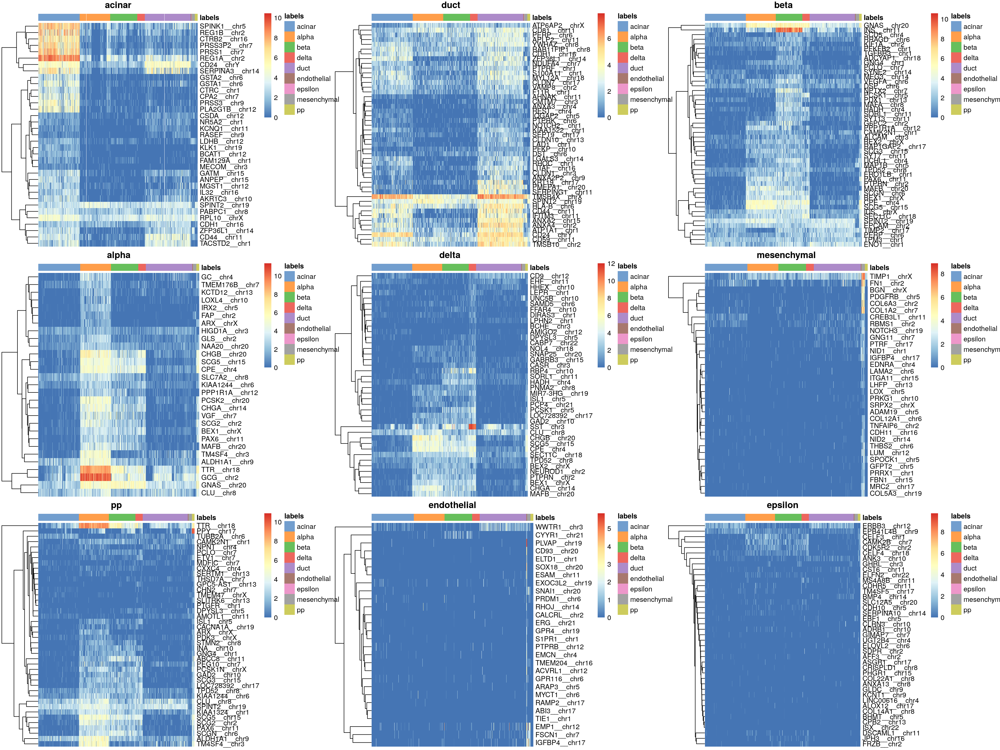

# (PART) Case studies {-}

# Cross-annotating human pancreas

<script>
document.addEventListener("click", function (event) {
    if (event.target.classList.contains("aaron-collapse")) {
        event.target.classList.toggle("active");
        var content = event.target.nextElementSibling;
        if (content.style.display === "block") {
            content.style.display = "none";
        } else {
            content.style.display = "block";
        }
    }
})
</script>

<style>
.aaron-collapse {
  background-color: #eee;
  color: #444;
  cursor: pointer;
  padding: 18px;
  width: 100%;
  border: none;
  text-align: left;
  outline: none;
  font-size: 15px;
}

.aaron-content {
  padding: 0 18px;
  display: none;
  overflow: hidden;
  background-color: #f1f1f1;
}
</style>

## Loading the data

We load the @muraro2016singlecell dataset as our reference, removing unlabelled cells or cells without a clear label.


```r
library(scRNAseq)
sceM <- MuraroPancreasData()
sceM <- sceM[,!is.na(sceM$label) & sceM$label!="unclear"] 
```

We compute log-expression values for use in marker detection inside `SingleR()`.


```r
library(scater)
sceM <- logNormCounts(sceM)
```

We examine the distribution of labels in this reference.


```r
table(sceM$label)
```

```
## 
##      acinar       alpha        beta       delta        duct endothelial 
##         219         812         448         193         245          21 
##     epsilon mesenchymal          pp 
##           3          80         101
```

We load the @grun2016denovo dataset as our test,
applying some basic quality control to remove low-quality cells in some of the batches
(see [here](https://osca.bioconductor.org/grun-human-pancreas-cel-seq2.html#quality-control-8) for details).


```r
sceG <- GrunPancreasData()

sceG <- addPerCellQC(sceG)
qc <- quickPerCellQC(colData(sceG), 
    percent_subsets="altexps_ERCC_percent",
    batch=sceG$donor,
    subset=sceG$donor %in% c("D17", "D7", "D2"))
sceG <- sceG[,!qc$discard]
```

Technically speaking, the test dataset does not need log-expression values but we compute them anyway for convenience.


```r
sceG <- logNormCounts(sceG)
```

## Applying the annotation

We apply `SingleR()` with Wilcoxon rank sum test-based marker detection to annotate the Grun dataset with the Muraro labels.


```r
library(SingleR)
pred.grun <- SingleR(test=sceG, ref=sceM, labels=sceM$label, de.method="wilcox")
```

We examine the distribution of predicted labels:


```r
table(pred.grun$labels)
```

```
## 
##      acinar       alpha        beta       delta        duct endothelial 
##         277         203         181          50         306           5 
##     epsilon mesenchymal          pp 
##           1          22          19
```

We can also examine the number of discarded cells for each label:


```r
table(Label=pred.grun$labels,
    Lost=is.na(pred.grun$pruned.labels))
```

```
##              Lost
## Label         FALSE TRUE
##   acinar        251   26
##   alpha         198    5
##   beta          180    1
##   delta          49    1
##   duct          301    5
##   endothelial     4    1
##   epsilon         1    0
##   mesenchymal    22    0
##   pp             17    2
```

## Diagnostics

We visualize the assignment scores for each label in Figure \@ref(fig:unref-pancreas-score-heatmap).


```r
plotScoreHeatmap(pred.grun)
```

<div class="figure">

<p class="caption">(\#fig:unref-pancreas-score-heatmap)Heatmap of the (normalized) assignment scores for each cell (column) in the Grun test dataset with respect to each label (row) in the Muraro reference dataset. The final assignment for each cell is shown in the annotation bar at the top.</p>
</div>

The delta for each cell is visualized in Figure \@ref(fig:unref-pancreas-delta-dist).


```r
plotDeltaDistribution(pred.grun)
```

<div class="figure">

<p class="caption">(\#fig:unref-pancreas-delta-dist)Distributions of the deltas for each cell in the Grun dataset assigned to each label in the Muraro dataset. Each cell is represented by a point; low-quality assignments that were pruned out are colored in orange.</p>
</div>

Finally, we visualize the heatmaps of the marker genes for each label in Figure \@ref(fig:unref-pancreas-marker-heat).


```r
library(scater)
collected <- list()
all.markers <- metadata(pred.grun)$de.genes

sceG$labels <- pred.grun$labels
for (lab in unique(pred.grun$labels)) {
    collected[[lab]] <- plotHeatmap(sceG, silent=TRUE, 
        order_columns_by="labels", main=lab,
        features=unique(unlist(all.markers[[lab]])))[[4]] 
}
do.call(gridExtra::grid.arrange, collected)
```

<div class="figure">

<p class="caption">(\#fig:unref-pancreas-marker-heat)Heatmaps of log-expression values in the Grun dataset for all marker genes upregulated in each label in the Muraro reference dataset. Assigned labels for each cell are shown at the top of each plot.</p>
</div>

## Comparison to clusters

For comparison, we will perform a quick unsupervised analysis of the Grun dataset.
We model the variances using the spike-in data and we perform graph-based clustering
(increasing the resolution by dropping `k=5`).


```r
library(scran)
decG <- modelGeneVarWithSpikes(sceG, "ERCC")

set.seed(1000100)
sceG <- denoisePCA(sceG, decG)
sceG$cluster <- clusterSNNGraph(sceG, k=5, use.dimred="PCA")
```

We see that the clusters map well to the labels in Figure \@ref(fig:unref-pancreas-label-clusters).


```r
tab <- table(cluster=sceG$cluster, label=pred.grun$labels) 
pheatmap::pheatmap(log10(tab+10))
```

<div class="figure">

<p class="caption">(\#fig:unref-pancreas-label-clusters)Heatmap of the log-transformed number of cells in each combination of label (column) and cluster (row) in the Grun dataset.</p>
</div>


We proceed to the most important part of the analysis.
Yes, that's right, the $t$-SNE plot (Figure \@ref(fig:unref-pancreas-label-tsne)).


```r
set.seed(101010100)
sceG <- runTSNE(sceG, dimred="PCA")
plotTSNE(sceG, colour_by="cluster", text_colour="red",
    text_by=I(pred.grun$labels))
```

<div class="figure">

<p class="caption">(\#fig:unref-pancreas-label-tsne)$t$-SNE plot of the Grun dataset, where each point is a cell and is colored by the assigned cluster. Reference labels from the Muraro dataset are also placed on the median coordinate across all cells assigned with that label.</p>
</div>

## Session information {-}

<button class="aaron-collapse">View session info</button>
<div class="aaron-content">
```
R version 4.0.0 Patched (2020-05-01 r78341)
Platform: x86_64-pc-linux-gnu (64-bit)
Running under: Ubuntu 18.04.4 LTS

Matrix products: default
BLAS:   /home/luna/Software/R/R-4-0-branch-dev/lib/libRblas.so
LAPACK: /home/luna/Software/R/R-4-0-branch-dev/lib/libRlapack.so

locale:
 [1] LC_CTYPE=en_US.UTF-8       LC_NUMERIC=C              
 [3] LC_TIME=en_US.UTF-8        LC_COLLATE=en_US.UTF-8    
 [5] LC_MONETARY=en_US.UTF-8    LC_MESSAGES=en_US.UTF-8   
 [7] LC_PAPER=en_US.UTF-8       LC_NAME=C                 
 [9] LC_ADDRESS=C               LC_TELEPHONE=C            
[11] LC_MEASUREMENT=en_US.UTF-8 LC_IDENTIFICATION=C       

attached base packages:
[1] parallel  stats4    stats     graphics  grDevices utils     datasets 
[8] methods   base     

other attached packages:
 [1] scran_1.17.4                SingleR_1.3.6              
 [3] scater_1.17.3               ggplot2_3.3.2              
 [5] scRNAseq_2.3.6              SingleCellExperiment_1.11.6
 [7] SummarizedExperiment_1.19.5 DelayedArray_0.15.6        
 [9] matrixStats_0.56.0          Matrix_1.2-18              
[11] Biobase_2.49.0              GenomicRanges_1.41.5       
[13] GenomeInfoDb_1.25.5         IRanges_2.23.10            
[15] S4Vectors_0.27.12           BiocGenerics_0.35.4        
[17] BiocStyle_2.17.0            rebook_0.99.0              

loaded via a namespace (and not attached):
 [1] bitops_1.0-6                  bit64_0.9-7                  
 [3] RColorBrewer_1.1-2            httr_1.4.1                   
 [5] tools_4.0.0                   R6_2.4.1                     
 [7] irlba_2.3.3                   vipor_0.4.5                  
 [9] DBI_1.1.0                     colorspace_1.4-1             
[11] withr_2.2.0                   gridExtra_2.3                
[13] tidyselect_1.1.0              processx_3.4.2               
[15] bit_1.1-15.2                  curl_4.3                     
[17] compiler_4.0.0                graph_1.67.1                 
[19] BiocNeighbors_1.7.0           labeling_0.3                 
[21] bookdown_0.20                 scales_1.1.1                 
[23] callr_3.4.3                   rappdirs_0.3.1               
[25] stringr_1.4.0                 digest_0.6.25                
[27] rmarkdown_2.3                 XVector_0.29.3               
[29] pkgconfig_2.0.3               htmltools_0.5.0              
[31] highr_0.8                     limma_3.45.7                 
[33] dbplyr_1.4.4                  fastmap_1.0.1                
[35] rlang_0.4.6                   RSQLite_2.2.0                
[37] shiny_1.5.0                   DelayedMatrixStats_1.11.1    
[39] farver_2.0.3                  generics_0.0.2               
[41] BiocParallel_1.23.0           dplyr_1.0.0                  
[43] RCurl_1.98-1.2                magrittr_1.5                 
[45] BiocSingular_1.5.0            GenomeInfoDbData_1.2.3       
[47] scuttle_0.99.10               Rcpp_1.0.4.6                 
[49] ggbeeswarm_0.6.0              munsell_0.5.0                
[51] viridis_0.5.1                 lifecycle_0.2.0              
[53] edgeR_3.31.4                  stringi_1.4.6                
[55] yaml_2.2.1                    zlibbioc_1.35.0              
[57] Rtsne_0.15                    BiocFileCache_1.13.0         
[59] AnnotationHub_2.21.1          grid_4.0.0                   
[61] blob_1.2.1                    dqrng_0.2.1                  
[63] promises_1.1.1                ExperimentHub_1.15.0         
[65] crayon_1.3.4                  lattice_0.20-41              
[67] cowplot_1.0.0                 locfit_1.5-9.4               
[69] CodeDepends_0.6.5             knitr_1.29                   
[71] ps_1.3.3                      pillar_1.4.4                 
[73] igraph_1.2.5                  codetools_0.2-16             
[75] XML_3.99-0.3                  glue_1.4.1                   
[77] BiocVersion_3.12.0            evaluate_0.14                
[79] BiocManager_1.30.10           vctrs_0.3.1                  
[81] httpuv_1.5.4                  gtable_0.3.0                 
[83] purrr_0.3.4                   assertthat_0.2.1             
[85] xfun_0.15                     rsvd_1.0.3                   
[87] mime_0.9                      xtable_1.8-4                 
[89] later_1.1.0.1                 viridisLite_0.3.0            
[91] pheatmap_1.0.12               tibble_3.0.1                 
[93] AnnotationDbi_1.51.1          beeswarm_0.2.3               
[95] memoise_1.1.0                 statmod_1.4.34               
[97] ellipsis_0.3.1                interactiveDisplayBase_1.27.5
```
</div>
